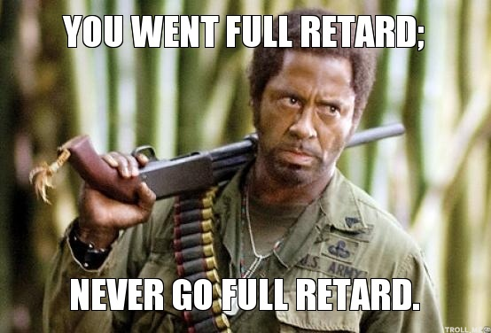

# **Re**pea**t**-**A**ssesment of **R**ibosomal **D**NA (**RETARD**)

## Synopsis

This is the repository for a academic project created by [Robin H. van der Weide](https://robinweide.github.io/): **Re**pea**t**-**A**ssesment of **R**ibosomal **D**NA (**RETARD**). Here you will find all the code to prepare, run and analyse the results of RETARD.

## Motivation

Some cool applications could be healthy/tumor differences, quantification through time (aging) or the results of gene-loss accumulation.

## Contributors

If you would like to help, please send me a message first: sometimes I forget to commit changes during the week (_I know, I know..._).

* [Email me](mailto:r.vd.weide@nki.nl)
* [Tweet to me](http://twitter.com/robinweide)
* [More about me](https://robinweide.github.io/)

## License

Licensed under the [Academic Free License](https://opensource.org/licenses/AFL-3.0) version 3.0
